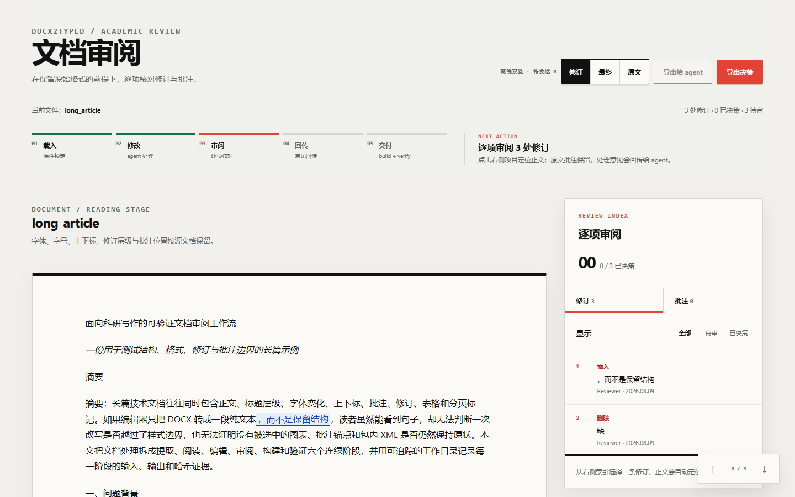
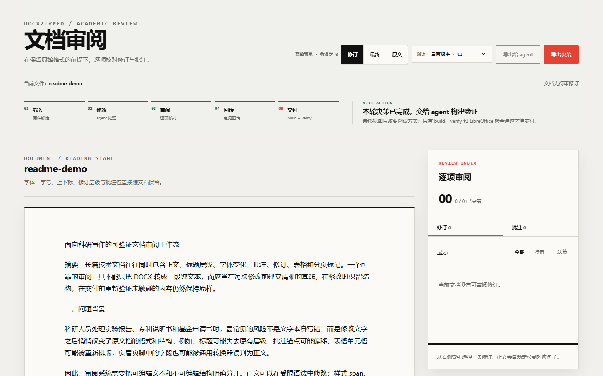

# docx2typed

[中文版本](https://github.com/LLLin000/docx2typed-typed-mode/blob/main/README.zh-CN.md) · [安装与协作指南](https://github.com/LLLin000/docx2typed-typed-mode/blob/main/Installation.md)

> Structure-preserving DOCX editing with a browser review console and agent handoff.

`docx2typed` changes the words in a `.docx` without flattening the document into lossy plain text or HTML. It keeps formatting, comments, tracked revisions, tables, content controls, anchors, and untouched document parts safe while the agent works.

<p align="center">
  
</p>

## Choose your path

| You want to… | Start here |
|---|---|
| Review a document in the browser | [Use the review console](#use-the-browser-review-console) |
| Have an agent edit the document | [Let an agent do the editing](#let-an-agent-do-the-editing) |
| Install the package or connect an agent | [Set up the agent](#set-up-the-agent) |

## Use the browser review console

The console is the human-facing review surface. It shows the document as a continuous page and keeps a fixed review rail beside it.

### Open a review session

The simplest path is to ask your agent:

> Open a browser review session for this document. Keep the original file safe and give me the review URL before making the final DOCX.

If a typed workdir already exists, the local review server can be started with:

```bash
docx2typed-review workdir --host 127.0.0.1 --port 8876
```

Open <http://127.0.0.1:8876/> in a browser. For a static, read-only page:

```bash
python -m docx2typed.review_console workdir -o review.html
```

### Review in the page

1. Use **修订**, **最终**, and **原文** to compare the tracked view, final view, and original view.
2. Select a revision or comment in the fixed rail. The document jumps to its paragraph and keeps the review context visible.
3. For a revision, choose **接受**, **拒绝**, or **暂缓** and add an optional note.
4. Select text in the document to **调整** it or **添加批注** for the agent.
5. In a live server session, choose **发送给 agent** after saving your decisions. The browser queues the work; the agent applies it and returns a new review snapshot.
6. In a standalone page, choose **导出决策** to download `review-decisions.json` for the agent.

The browser is a review and handoff surface. It does not silently rewrite the source DOCX. The agent performs the edit, build, verification, and final Word/LibreOffice check.

### Phone review

For short-lived collaboration on a private Tailscale network:

```bash
docx2typed review workdir --tailscale --port 8876
```

Open the printed URL on a phone signed in to the same tailnet. Keep access restricted to the intended collaborators and do not expose the review port to the public Internet.

<p align="center">
  
</p>

## Let an agent do the editing

Give the agent the source DOCX and the outcome you want. You do not need to edit `typed.md`, manage revision IDs, or copy skill files into a hidden directory.

A useful request looks like this:

> Please revise `input.docx` for [goal]. Keep the original file unchanged. [Track changes / apply changes directly]. Keep existing comments unless I explicitly ask you to delete them. Start a browser review session after the first pass, wait for my decisions, then build and verify the final DOCX. Return the output path and a short summary of changes and remaining comments/revisions.

The agent should:

1. Install or enable the `docx2typed` skill and its runtime when needed.
2. Copy the source into a new workdir and report the starting document state.
3. Make only the requested text or explicitly requested table operations.
4. Start the browser review console so you can inspect the result.
5. Consume your accepted, rejected, deferred, or text-anchored decisions.
6. Build a new DOCX, verify it independently, and run the final Word/LibreOffice interoperability check.

Comments remain in the document by default. Ask explicitly if a comment must be deleted. Text-length changes may naturally reflow lines and pages; that is different from changing the document's formatting.

## Set up the agent

Skill installation belongs to the agent, not to the user. Ask your agent:

> Install and enable the `docx2typed` skill, install the `docx2typed` package if needed, and configure the MCP connection for this host. Preserve my existing agent configuration.

The agent should use the host's normal skill manager and installation location. Do not manually copy `SKILL.md` or guess a platform-specific skills directory. The [installation and collaboration guide](Installation.md) is the agent-facing procedure for PyPI, MCP, and optional Tailscale setup.

For a normal Python installation, the package is available from PyPI:

```bash
python -m pip install --upgrade docx2typed
```

For a one-shot isolated command, an agent can use:

```bash
uvx docx2typed extract input.docx -o workdir
```

If you use Claude and have authorized MCP configuration, the supported entry is:

```bash
claude mcp add docx2typed -- uvx docx2typed mcp
```

## What is preserved

| Need | Guarantee |
|---|---|
| Protect the source | Extraction and review do not overwrite the original `.docx`. |
| Keep formatting | Existing style ownership, paragraph structure, anchors, and untouched package parts remain protected. |
| Review changes | Word tracked revisions, comments, and paragraph-level navigation remain available. |
| Deliver a DOCX | The agent builds a new file, verifies it independently, and checks it with Word-compatible tooling. |

This is a structure-preserving editing engine, not a browser replacement for Microsoft Word. The browser helps people review decisions; the built DOCX is the final deliverable.

## Further reading

- [Installation and collaboration guide](Installation.md)
- [CLI and MCP capabilities](capabilities.md)
- [End-to-end workflows](composites.md)
- [Verification guarantees](verification.md)
