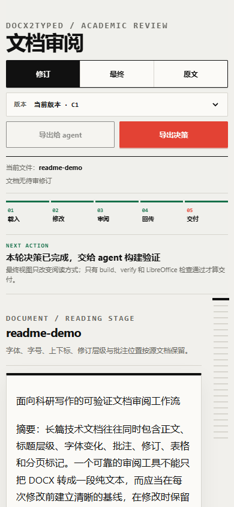

# docx2typed

[英文版本](README.md)

[Agent 安装流程](https://github.com/LLLin000/docx2typed-typed-mode/blob/main/Installation.md)

> 需要让 Agent 自动配置时，直接把[安装流程](https://github.com/LLLin000/docx2typed-typed-mode/blob/main/Installation.md)发给它；
> 其中包含 PyPI 安装、MCP 注册和临时 Tailscale 手机协作流程。

> **面向智能体与审阅者的结构保真 DOCX 文本编辑。**
>
> `docx2typed` 让智能体能够修改 `.docx` 中的文字，而不把文档压平成有损的纯文本或 HTML。typed workdir 会锁定样式归属、锚点、修订身份、批注、表格结构、内容控件和未触碰的包部件；只有明确要求修改的文字会发生变化。

<p align="center">
  
</p>

<p align="center"><sub>合成审阅演示：行内修订、固定段落跳转索引，以及明确的 build + verify 交付边界；不使用真实用户文档数据。</sub></p>

## 为什么它不只是 DOCX 转 HTML

| 读者看到的界面 | 引擎保证的边界 |
|---|---|
| 连续的文档正文与固定审阅索引。 | 审阅页面直接从 canonical typed AST 渲染，不使用有损的 `edit.md` 投影视图。 |
| 文本编辑、修订、批注指令、表格操作和内容控件。 | 未改变的结构保持锁定；样式归属不明确时直接安全失败，而不是猜测。 |
| 新的 DOCX 与一条证据链。 | `build` 写出文件前先校验，`verify` 独立重建并检查结果，再由 LibreOffice 检查互操作性。 |

### 发布验收门槛

发布验收套件刻意采用对抗式设计：**32 个确定性黑盒任务**、**6 个变形关系**，并设置 **0 个未知能力**、**0 个静默损坏**的硬门槛。浏览器页面看起来合理并不代表项目完成；最终 DOCX 必须通过结构级和包级验收。

> **项目定位：**这是一个结构保真的编辑引擎，不是 Microsoft Word 的浏览器克隆。浏览器控制台是语义审阅界面；`build`、`verify` 和 LibreOffice 互操作检查才是交付证据。

## 核心契约

| 契约 | 保证 |
|---|---|
| 只移动明确要求修改的文字。 | 未触碰的自然段、样式、锚点和包部件不会被顺手重写。 |
| 源文件保持安全。 | `extract` 不修改输入文件；结构操作和全量修订决策会写入新的 DOCX/workdir。 |
| 样式归属保持明确。 | 编辑必须依据 `regions.md` 规划；跨区域且无法判断归属的改写会被拒绝，而不是猜样式。 |
| 批注默认保留。 | 智能体可以处理批注中的指令，但批注 ID、文本、日期、作者和锚点会保留，除非用户明确要求删除。 |

## 安装

### 环境要求

- Python **3.11+**
- `python-docx` 和 `mcp` 会根据包元数据自动安装
- 最终互操作性检查推荐安装 LibreOffice Writer
- Tailscale 为可选项，仅在需要手机访问时使用

### 一键安装源码版本

在源码目录中，根据平台运行对应安装脚本：

```powershell
# Windows PowerShell
.\install.ps1

# 开发安装：源代码修改后立即生效
.\install.ps1 -Editable
```

```bash
# macOS / Linux
./install.sh

# 开发安装：源代码修改后立即生效
./install.sh --editable
```

两个安装脚本都会创建 `.venv`、安装当前源码，不修改系统 Python，并对
`docx2typed` CLI 做一次冒烟检查。

### PyPI 安装

```bash
python -m pip install --upgrade docx2typed

# 或使用 uv 安装隔离的 CLI
uv tool install --upgrade docx2typed

# 确认 CLI 已安装
docx2typed extract --help
```

### 源码目录手动安装

```bash
python -m pip install .

# 开发源码目录：
python -m pip install -e .
```

安装后会提供以下入口：

```text
docx2typed          # CLI，包含 mcp 和 review 子命令
docx2typed-mcp      # stdio MCP 服务
docx2typed-review   # 本机审阅服务
```

统一命令适合直接配置工具：

```bash
docx2typed mcp
docx2typed review workdir --host 127.0.0.1 --port 8876
```

直接从源码运行时，将已安装模块名替换为 `scripts`：

```bash
python -m scripts extract input.docx -o workdir
python -m scripts.review_console workdir -o review.html
python -m scripts.review_server workdir --port 8876
```

## 五分钟流程

### 1. 提取

```bash
docx2typed extract input.docx -o workdir
```

`input.docx` 保持不变。workdir 会记录源文件和模板指纹，并生成 canonical typed projection 以及可编辑 sidecar 文件。

### 2. 先通读，再局部检查

```bash
docx2typed view workdir --mode clean
docx2typed view workdir --mode style
docx2typed view workdir --mode raw

# 编辑前检查新鲜度。
docx2typed edit status workdir
```

- `clean`：用于理解文档的连续正文。
- `style`：正文加样式区域诊断。
- `raw`：typed 标记、段落 ID、表格、范围、锚点、修订和结构 token。

先完整阅读一次 `clean` 投影；只有在确定要修改的段落附近，才使用 `regions.md` 和段落级检查。

### 3. 编辑

在编辑器中打开 `workdir/edit.md`，只在相关样式区域内修改文字。不要重写 `typed.md` 头部或结构标记，然后同步草稿：

```bash
# 普通文本编辑：不生成新的 Word 修订。
docx2typed edit sync workdir --no-track

# 或将编辑呈现为真实的 w:ins/w:del 修订。
docx2typed edit sync workdir --track --author "Reviewer"
```

如果直接修改了 `typed.md`，先刷新投影：

```bash
docx2typed edit refresh workdir
```

如果草稿是有意丢弃的，使用 `--discard`；不要意外覆盖 dirty draft。

### 4. 构建

```bash
docx2typed validate workdir
docx2typed build workdir -o output.docx
```

`build` 要求 workdir 处于有效 clean 状态；遇到结构无效、编辑过期、未解决冲突或不安全范围变化时会安全失败。

### 5. 验证

```bash
docx2typed verify workdir output.docx
```

`verify` 会独立地根据 workdir 重新推导输出结果。结构化证据包含检查项、修订数量与作者，以及仍然存在的批注 ID。

### 6. 使用兼容 Word 的工具做互操作检查

用 LibreOffice Writer 打开或转换构建出的 DOCX。只有 `verify` 通过，并且 LibreOffice 打开或转换时没有修复提示，交付才算完成。

## 格式查看与审阅控制台

### 独立 HTML

从 canonical typed AST 生成自包含审阅页面：

```bash
# 已安装包：
python -m docx2typed.review_console long-wd -o review.html

# 源码仓库：
python -m scripts.review_console long-wd -o review.html
```

在浏览器中打开 `review.html`。控制台会结合 `typed.md` 和 `styles.json` 渲染；它不使用有损的 `edit.md` 投影，也不引入外部 DOCX-to-HTML 渲染器。

### 本地交互服务

```bash
docx2typed-review long-wd --host 127.0.0.1 --port 8876
```

打开 <http://127.0.0.1:8876/>。服务提供审阅页面和本地交接 API。审阅索引会固定在侧边：点击修订或批注后，正文跳到对应段落，同时保留决策上下文。技术样式诊断默认收起，让普通读者看到文档，而不是内部元数据。

直接从源码运行时：

```bash
python -m scripts.review_server long-wd --host 127.0.0.1 --port 8876
```

### 通过 Tailscale 临时协作

在拥有 workdir 的电脑上启动审阅服务：

```bash
docx2typed review long-wd --tailscale --port 8876
```

命令会执行 `tailscale ip -4`，只绑定本机的 Tailscale IPv4 地址，并打印
手机访问地址，例如 `http://100.x.y.z:8876/`。手机登录同一个 tailnet
后打开该地址即可。浏览器和桌面端、Agent 共用同一个服务状态；审阅页面
会定期获取新的快照和待处理决策。

这是临时的私有网络模式，不是公网部署：

- 只在 Tailscale ACL 中允许需要协作的成员；
- 不要把 `--tailscale` 替换为 `--host 0.0.0.0`；
- 传输层是 tailnet 内的普通 HTTP，不要把端口暴露到 Tailscale 之外。

使用前必须安装 Tailscale，并确保 `tailscale` 命令位于 `PATH` 中。

浏览器界面刻意采用语义优先、阅读优先的设计：

- 正文保持连续流动，不拆成孤立的证据卡片；
- 插入和删除修订保留行内位置及其元数据；
- 批注记录展示真实文本和锚点段落；
- 样式归属来自 Word 样式注册表和 `styles.json`；
- 不支持的 Word 排版细节不会被静默改写，最终保真度以构建出的 DOCX 为准。

### 截图

<table>
  <tr>
    <td width="72%"></td>
    <td width="28%"></td>
  </tr>
  <tr>
    <td><sub><strong>桌面端</strong>——纸张式阅读区；正文连续展示，审阅索引始终可见。</sub></td>
    <td><sub><strong>移动端</strong>——侧栏收敛为可访问的紧凑控件，不产生横向溢出。</sub></td>
  </tr>
</table>

## 常用工作流

### 普通文本编辑

```bash
docx2typed extract input.docx -o workdir
docx2typed view workdir --mode clean
# 在一个样式区域内编辑 workdir/edit.md
docx2typed edit sync workdir --no-track
docx2typed build workdir -o edited.docx
docx2typed verify workdir edited.docx
```

### 修订式编辑

```bash
docx2typed extract input.docx -o tracked-wd
# 编辑 tracked-wd/edit.md
docx2typed edit sync tracked-wd --track --author "AI Reviewer"
docx2typed build tracked-wd -o tracked.docx
docx2typed verify tracked-wd tracked.docx
```

输出会包含真实的 `w:ins`/`w:del` 节点。已有修订保持不变；新修订写入当前会话的作者和日期。

### 单项修订决策

先读取 `revisions.json`。修订 key 的形式是 `part|kind|w:id|fingerprint`：

```bash
docx2typed decide accept "word/document.xml|insert|8|..." \
  --workdir tracked-wd --fingerprint "..."

docx2typed decide reject "word/document.xml|delete|7|..." \
  --workdir tracked-wd --fingerprint "..."
```

fingerprint 用于防止用户基于过期的审阅选择做决策。

### 全量接受或拒绝

```bash
docx2typed decide accept-all \
  --workdir tracked-wd \
  --output accepted.docx \
  --workdir-out accepted-wd

docx2typed verify accepted-wd accepted.docx
```

`reject-all` 的参数形状相同。源 workdir 永远不会被原地修改；新 workdir 是一个 clean baseline。

### 批注返修

在 MCP 中，批注是一等审阅对象：

```text
workdir_open(workdir, author="AI Reviewer", track=true)
list_comments()
get_comment(comment_id)
# 执行按样式区域限定的修订
commit_sync()
build_docx(output="comment-reviewed.docx")
verify_output(output="comment-reviewed.docx")
```

正常的智能体路径会保留每个批注的 ID、作者、日期、文本和锚点。不要因为正文编辑完成就调用 `delete_comment`。如果用户明确要求删除批注 `1`，CLI 等价命令为：

```bash
docx2typed decide comment-delete 1 --workdir workdir
```

### 表格结构

表格引用是正文级序号（`T0`、`T1`……），通过 `view --mode raw` 获取：

```bash
docx2typed decide table-insert-row T0 \
  --workdir workdir --args "2" \
  --output table-row.docx --workdir-out table-row-wd

docx2typed decide table-merge-cells T0 \
  --workdir workdir --args "0 1 2" \
  --output table-merged.docx --workdir-out table-merged-wd
```

行和列从 0 开始编号。如果被合并的单元格包含文字，合并会安全失败；只有在明确允许内容损失时，才使用显式 discard 选项。表格工具会生成新的 DOCX/workdir，不会隐式重写单元格文字。

### Unicode 上下标归一化

```bash
docx2typed audit scan workdir -o scan.json
# 人工审阅 scan.json，并生成绑定哈希的批准策略。
docx2typed audit apply workdir \
  --scan scan.json \
  --policy policy.json \
  -o normalized.docx \
  --workdir-out normalized-wd

docx2typed verify normalized-wd normalized.docx
```

分类结果只是建议。候选项在获得批准策略前会保持原样。

### 内容控件文本

内容控件中的段落会暴露为 `S0.P0` 等 ID。可以像编辑正文一样，通过 `edit.md` 或 MCP 修改其中的文字。控件属性（`w:sdtPr`）保持锁定；控件本身的结构插入和删除不属于当前契约。

## MCP 集成

完成源码安装后，为任意 stdio MCP 宿主配置：

```json
{
  "mcpServers": {
    "docx2typed": {
      "command": "python",
      "args": ["-m", "docx2typed.mcp_server"]
    }
  }
}
```

带标签的版本发布到 PyPI 后，可以使用隔离的一行命令：

```bash
claude mcp add docx2typed -- uvx docx2typed mcp
```

MCP 宿主的 JSON 配置可以写成：

```json
{
  "mcpServers": {
    "docx2typed": {
      "command": "uvx",
      "args": ["docx2typed", "mcp"]
    }
  }
}
```

如果宿主不会继承安装包所在的环境，可以加入 `cwd`，或使用该环境中的 Python 绝对路径。服务和 CLI 使用同一套 typed-workdir 引擎，以及同一套 build/verify 门槛。

推荐的 MCP 顺序：

```text
workdir_open
list_paragraphs / get_paragraph / list_comments
replace_text / batch_edit / insert_paragraph / delete_paragraph
diff_preview
commit_sync
build_docx
verify_output
```

MCP 编辑受样式区域约束。未改变的字符保持其精确样式；只有在归属明确时，替换文字才会继承被替换区域的样式；跨区域改写会被拒绝，而不是猜测结果。

## 工作目录产物

| 文件 | 用途 |
|---|---|
| `typed.md` | canonical typed AST 投影；包含段落和结构标记。 |
| `edit.md` | 人类可读的编辑草稿；正文变化会同步回 AST。 |
| `format.json` | 段落、token、包部件结构和源文件元数据。 |
| `styles.json` | 从 Word `rPr` 派生的样式注册表，供语义审阅控制台使用。 |
| `regions.md` | 样式区域边界和安全编辑规划索引。 |
| `revisions.json` / `revisions.md` | 修订清单和修订 key。 |
| `edit.state.json` / `edit.state.json.run.json` | 新鲜度状态和绑定哈希的编辑证据。 |
| `_template.docx` | 重建时使用的保留包模板。 |
| `.review/` | 使用 review server 时生成的本地草稿、快照、历史和协作状态。 |

## 验收与开发

需要时，将临时目录放在非系统盘上运行聚焦测试：

```bash
python -m pytest -q --basetemp=D:/L/AppData/pytest-tmp
```

冒烟命令：

```bash
python -m scripts.acceptance_corpus --workdir D:/L/AppData/docx2typed-corpus-run
python -m scripts.tool_smoke --workdir D:/L/AppData/smoke-run
```

发布验收使用确定性 fixture、32 个黑盒任务、6 个变形关系和智能体提示词：

```bash
python -m scripts.release_fixtures --outdir corpus/release
python -m scripts.release_acceptance \
  --report reports/release-local \
  --workdir D:/L/AppData/release-run
python -m scripts.agent_bench --list
python -m scripts.agent_bench --grade <task> <out.docx> <workdir>
```

绿色的发布摘要必须包含：

```text
task acceptance N/N
metamorphic N/N
unknown capability 0
silent corruption 0
```

## 长文演示

下面的脚本创建一份有真实纵向长度的结构化长文，而不是只有一行的 fixture。它包含标题、长段落、混合强调、上下标和表格，用于观察审阅界面是否能渲染真实的长度和格式标记。

将其保存为 `make_long_article.py`，然后在同一目录运行：

```python
from docx import Document
from docx.enum.text import WD_ALIGN_PARAGRAPH
from docx.shared import Pt


def add_body(document: Document, text: str) -> None:
    paragraph = document.add_paragraph(text)
    paragraph.paragraph_format.space_after = Pt(8)
    paragraph.paragraph_format.line_spacing = 1.25


doc = Document()
section = doc.sections[0]
section.top_margin = Pt(54)
section.bottom_margin = Pt(54)
section.left_margin = Pt(64)
section.right_margin = Pt(64)

heading = doc.add_heading("面向科研写作的可验证文档审阅工作流", level=0)
heading.alignment = WD_ALIGN_PARAGRAPH.CENTER

subtitle = doc.add_paragraph()
run = subtitle.add_run("一份用于测试结构、格式、修订与批注边界的长篇示例")
run.italic = True

abstract = (
    "长篇技术文档往往同时包含正文、标题层级、字体变化、上下标、批注、修订、表格和分页标记。"
    "如果编辑器只把 DOCX 转成一段纯文本，读者虽然能看到句子，却无法判断一次改写是否越过了样式边界，"
    "也无法证明没有被选中的图表、批注锚点和包内 XML 是否仍然保持原状。本文把文档处理拆成提取、阅读、编辑、"
    "审阅、构建和验证六个连续阶段，并用可追踪的工作目录记录每一阶段的输入、输出和哈希证据。"
)
doc.add_heading("摘要", level=1)
add_body(doc, abstract)

doc.add_heading("一、问题背景", level=1)
add_body(
    doc,
    "科研人员处理实验报告、专利说明书、基金申请书和学位论文时，最常见的风险不是某个句子缺少一个形容词，"
    "而是修改文字之后悄悄改变了原文档的格式和结构。例如，标题可能从居中变成左对齐，变量的上标可能被普通字符替代，"
    "表格中的一个空单元格可能被错误地复制了相邻文本，批注范围也可能因为段落重建而失效。问题的难点在于，文本语义和"
    "WordprocessingML 结构同时存在：人需要连续可读的文章，工具则必须保留每个可验证的边界。"
)


doc.add_heading("二、可验证的中间表示", level=1)
add_body(
    doc,
    "typed workdir 不是临时文本缓存，而是一份带有段落 ID、样式区域、基线哈希和来源部件信息的中间表示。clean projection "
    "适合快速通读全文；style projection 显示字体、字号、颜色、上下标和其他格式归属；raw projection 则把段落标记、表格引用、"
    "修订节点、批注锚点和不可展开的结构节点放回视野。编辑前，工具首先判断替换是否只覆盖一个样式区域；如果一次替换混合了"
    "多个区域，系统会给出拆分建议，而不会猜测新的样式。"
)


doc.add_heading("三、修订与批注的职责边界", level=1)
paragraph = doc.add_paragraph()
paragraph.add_run("修订是可以作出决策的变更，批注是外部审阅者给出的指令。 ").bold = True
paragraph.add_run(
    "在 track mode 中，一次替换会生成对应的删除和插入修订，作者与日期写入 Word 修订节点；在 comment review 中，"
    "工具读取批注文本和锚点，完成正文编辑，但默认保留批注本身。这样，老师或用户仍可以在 Word 中看到原始指示，并自行决定"
    "何时清理它们。只有明确执行 comment-delete 操作，才会删除批注条目、范围锚点和引用。"
)


doc.add_heading("四、格式标记与真实输出", level=1)
add_body(
    doc,
    "格式标记不能只在浏览器里看起来正确。粗体、斜体、删除线、字体、字号、颜色、底纹、上下标、下划线、段落对齐、"
    "分页标记、表格和内容控件都需要经过同一套结构化路径。浏览器审阅控制台负责帮助人快速定位段落和修订；最终 DOCX 由"
    "build 重新组装，由 verify 独立检查，再通过 LibreOffice 做互操作检查。浏览器无法完整模拟 Word 排版时，结构不会被静默"
    "扁平化，交付判断仍以 DOCX 级别的证据为准。"
)


doc.add_heading("五、一个小型实验表", level=1)
table = doc.add_table(rows=1, cols=3)
table.style = "Table Grid"
for cell, value in zip(table.rows[0].cells, ["阶段", "输入", "可检查证据"]):
    cell.text = value
for row in [
    ("提取", "source.docx", "source/template fingerprint"),
    ("编辑", "edit.md", "region ownership + run evidence"),
    ("审阅", "revisions.json", "revision key + comment IDs"),
    ("交付", "output.docx", "verify + LibreOffice"),
]:
    cells = table.add_row().cells
    for cell, value in zip(cells, row):
        cell.text = value


doc.add_heading("六、结语", level=1)
add_body(
    doc,
    "可验证的文档编辑不是把 Word 文件转换得像文本，而是让每次文字变化都有明确的范围、状态、证据和回滚边界。"
    "当读取、编辑、审阅、构建和验证被串成一条连续链路时，格式保真不再依赖一次幸运的导入导出，也不再要求用户在每个"
    "段落之后手工检查整个文件。这个示例故意保留足够长的正文，使侧边栏跳转、连续滚动、样式诊断和最终交付检查都能在真实"
    "的页面长度上被观察。"
)

# 在最后一段加入明确的格式标记。
marker = doc.add_paragraph("标记探针：")
marker.add_run("bold").bold = True
marker.add_run(" / ")
marker.add_run("italic").italic = True
marker.add_run(" / ")
sup = marker.add_run("x2")
sup.font.superscript = True
marker.add_run(" / ")
sub = marker.add_run("H2O")
sub.font.subscript = True


doc.save("long_article.docx")
print("wrote long_article.docx")
```

运行完整流程：

```bash
python make_long_article.py

docx2typed extract long_article.docx -o long-wd
docx2typed view long-wd --mode clean
docx2typed view long-wd --mode style

# 编辑 long-wd/edit.md，然后：
docx2typed edit sync long-wd --track --author "Reviewer"
docx2typed build long-wd -o long_article-reviewed.docx
docx2typed verify long-wd long_article-reviewed.docx
```

## 文档地图

- [`SKILL.md`](SKILL.md) —— 面向智能体的契约和分支表。
- [`capabilities.md`](capabilities.md) —— 每个 CLI 原子命令和 MCP 工具的精确语法及退出契约。
- [`composites.md`](composites.md) —— 七个工作流和端到端操作手册。
- [`verification.md`](verification.md) —— 新鲜度、安全失败、字节保真和互操作门槛。
- [`docs/rpr-reference.md`](docs/rpr-reference.md) —— Word `rPr` XML 到样式的转换说明。

## 中文速查

1. 使用 `python -m pip install -e .` 安装。
2. 使用 `docx2typed extract input.docx -o workdir` 提取，且不修改源文件。
3. 先完整阅读 `view --mode clean`；只在需要处检查 `style` 或 `raw`。
4. 在 `regions.md` 列出的区域内编辑 `edit.md`。
5. 使用 `edit sync --no-track`，或使用 `edit sync --track --author NAME` 同步。
6. 构建、独立验证，并进行 LibreOffice 互操作检查。
7. 使用 `docx2typed-review workdir --port 8876` 打开固定审阅索引和段落跳转。
8. 使用 MCP 执行按区域限定的智能体编辑、修订决策、批注清单、协作、表格操作、构建和验证。

安全默认值保持保守：批注默认保留，样式归属不明确时安全失败，源 workdir 不会被结构操作原地修改；在输出证据变绿之前，不把任何文档称为已完成。
